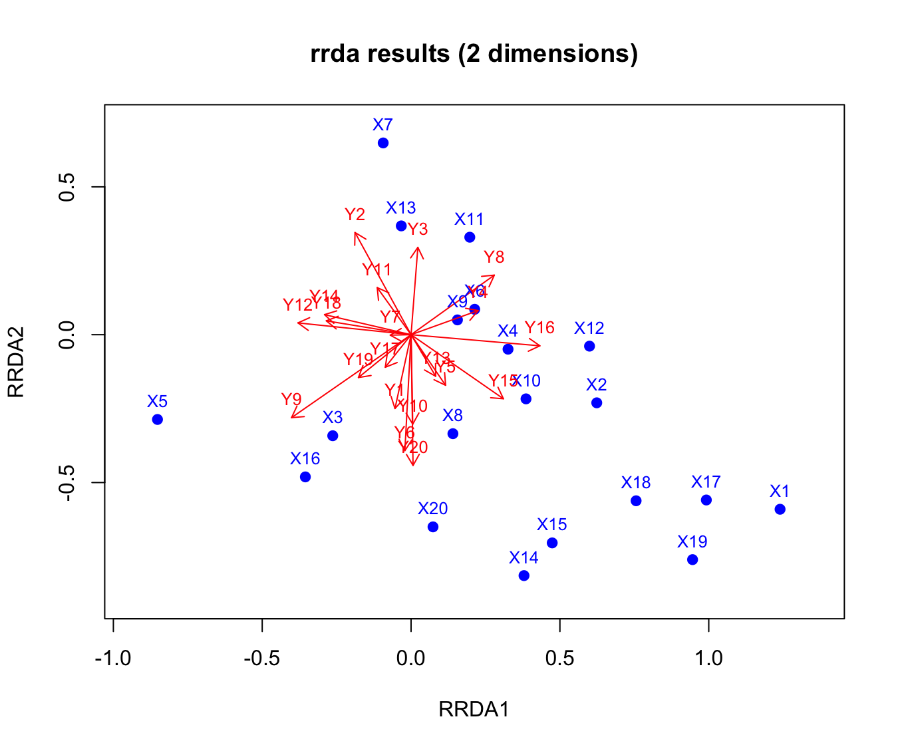
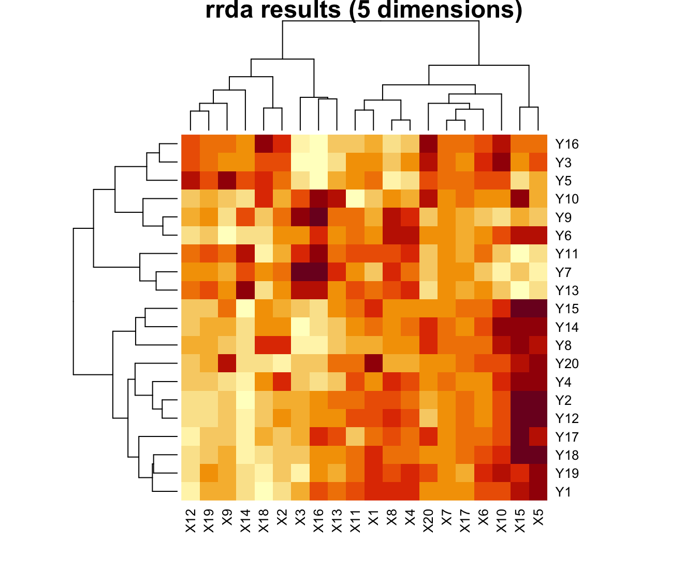
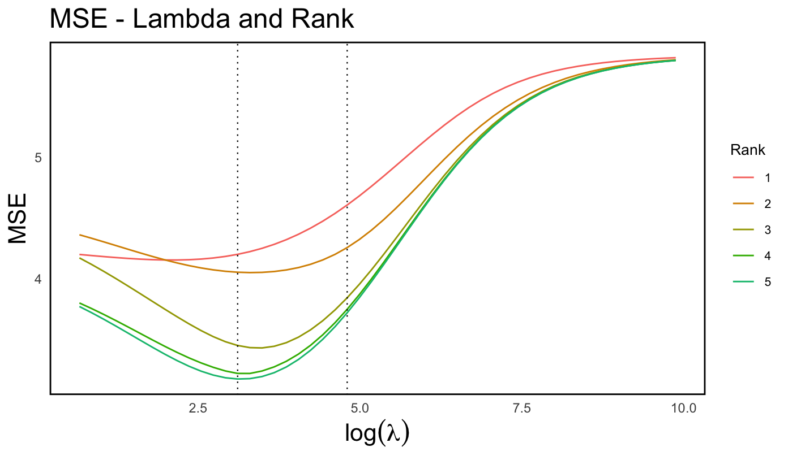
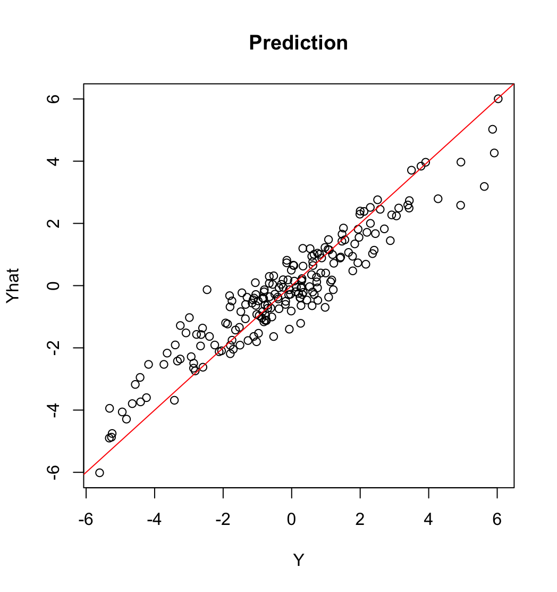

# rrda: Ridge Redundancy Analysis for High-Dimensional Omics Data 

<!-- badges: start -->
[](https://cran.r-project.org/package=rrda)
[](https://lifecycle.r-lib.org/articles/stages.html)
<!-- badges: end -->

> The R package `rrda` provides functions for performing **ridge redundancy analysis (rrda)** 
> for high-dimensional datasets. It is useful for modeling the relationship between a matrix
>  of response variables (**Y**; n × q ) and a matrix of explanatory variables (**X**;  n × p ).
>  The method is designed to handle **high-dimensional data efficiently**, allowing
>  computation and storage optimization.


## 🇫🇷Overview🇯🇵
Hello / Bonjour / Konichiwa

- rrda/script_rrda:  Scripts and my own functions used in our article.
- rrda/RDAdata:  Application data used in our article.

## 📌 Please cite :)

**Yoshioka, H., Aubert, J., Iwata, H., and Mary-Huard, T. (2025).**  Ridge Redundancy Analysis for High-Dimensional Omics Data. *bioRxiv*, doi: https://doi.org/10.1101/2025.04.16.649138

The package is documented on CRAN (https://cran.r-project.org/package=rrda)

## 🛠 Installation

You can install the package from CRAN

```r
install.packages("rrda")
```


## 💡 Tutorial

#### Example 1: Fitting

`rdasim1` function generates rank-restricted matrices X and Y. 

```r
library(rrda)
set.seed(123)
simdata <- rdasim1(n = 10, p = 20, q = 20, k = 5)
X <- simdata$X
Y <- simdata$Y
```
`rrda.fit` function solves the rrda (ridge redundancy) for X and Y. 
This is equivalent to the prediction from X to Y, where Y = XB + E.

`nrank` indicates the rank restrictions for the model. Here, it is the value of 1 to 5.

`lambda` indicates the ridge penalty for the model. Here, it is the value of 0.1, 1, 10.   

The model solves several ranks and lambdas efficiently. In this case, the model returns all the combinations of ranks and lambdas (3 times 5 = 15).

```r
Bhat <- rrda.fit(Y = Y, X = X, nrank = c(1:5), lambda = c(0.1,1,10))
names(Bhat)
```

When you see the Bhat, you will see the list composed of each lambda. In each lambda value, you have the coefficient `B` according to each rank.

(Note! The Bhat is stored in a decomposed form. This is because the function is designed for high-dimensional settings.)


If you want to plot X and Y matrix in two-dimensional space (like classic RDA approach) :

```r
# You want to specify one lambda in `rrda.fit` to visualize (if not, you can also specify the location afterward)
Bhat_lambda0.1 <- rrda.fit(Y = Y, X = X, nrank = c(1:5), lambda = c(0.1))

ud<-Bhat[[1]][[1]][[1]] #you can also specify the location if you have multiple lambda
v<-Bhat[[1]][[1]][[2]]  #you can also specify the location if you have multiple lambda

ud12 <- ud[, 1:2]
v12 <- v[, 1:2]

# Base plot: ud (e.g., site scores)
plot(ud12, 
     xlab = "RRDA1", ylab = "RRDA2", 
     xlim = range(c(ud12[,1], v12[,1])) * 1.1, 
     ylim = range(c(ud12[,2], v12[,2])) * 1.1, 
     pch = 19, col = "blue", 
     main = "rrda results (2 dimensions)")

# Add v (e.g., species scores) as arrows from origin
arrows(0, 0, v12[,1], v12[,2], col = "red", length = 0.1)

# Optionally add text labels
text(ud12, labels = paste0("X", 1:nrow(ud12)), pos = 3, col = "blue", cex = 0.8)
text(v12, labels = paste0("Y", 1:nrow(v12)), pos = 3, col = "red", cex = 0.8)
```


If you want to have a matrix form of B, you can perform:

```r
Bhat_mat_all <- rrda.coef(Bhat = Bhat)
```

If you want to specify the rank or lambda, you may indicate as below
```r
Bhat_mat <- rrda.coef(Bhat = Bhat, nrank = 5, lambda= 1)
```

Maybe a heatmap can explain the variable relationships

```r
h5<-Bhat_mat$lambda1$rank5
#h5<-Bhat_mat[[1]][[1]] #same result
rownames(h5) <- paste0("Y", 1:nrow(h5))
colnames(h5) <- paste0("X", 1:ncol(h5))

heatmap(h5, main = "rrda results (5 dimensions)")
```


#### Example 2: Parameter Tuning by Cross-Validation

How do we know the best lambda and rank ??

-> Cross-validation by `rrda.cv` function

```r
set.seed(123)
simdata <- rdasim1(n = 10, p = 20, q = 20, k = 5)
X <- simdata$X
Y <- simdata$Y

cv_result <- rrda.cv(Y = Y, X = X, maxrank = 10) # cv
rrda.summary(cv_result = cv_result) # cv result

# Plot the CV result
p <- rrda.plot(cv_result)
print(p)

# Heatmap of the CV result
h <- rrda.heatmap(cv_result)
print(h)
```
`rrda.summary` tells you the parameters suggested via CV. 

```
=== opt_min ===
MSE: 
[1] 3.179695
rank: 
[1] 5
lambda: 
[1] 22.43
```

Also, `rrda.plot` and `rrda.heatmap` show you the figures to select the parameters.

<div style="display: flex; align-items: center; gap: 10px;">
  
</div>

```r
# Extract optimal parameters
estimated_lambda <- cv_result$opt_min$lambda
estimated_rank <- cv_result$opt_min$rank

# Fit the model with the optimal parameters
Bhat <- rrda.fit(Y = Y, X = X, nrank = estimated_rank, lambda = estimated_lambda)
Bhat_mat <- rrda.coef(Bhat)

# Make predictions
Yhat_mat <- rrda.predict(Bhat = Bhat, X = X)
Yhat <- Yhat_mat[[1]][[1]][[1]]

# Correlation
cor_Y_Yhat <- diag(cor(Y, Yhat))
summary(cor_Y_Yhat)

# Plot
plot(Y,Yhat)

```

<div style="display: flex; align-items: center; gap: 10px;">
  
</div>


## 📦 Dependencies

- `RSpectra`
- `furrr`
- `dplyr`
- `reshape2`
- `ggplot2`

## 📊 Data

For the application data, the data for breast cancer (Witten et al., 2009) and soybean data (Dang et al., 2023) are stored on this page. Also, refer to Ruiz-Arenas and González 2020) for the methylation data. 

The application data of breast cancer and soybean are stored as .rds file in a folder (rrda/RDAdata). For methylation data, you can refer to the R package (MEAL, Ruiz-Arenas and González 2024)

The metabolome data were downloaded from the RIKEN DropMet website (http://prime.psc.riken.jp/menta.cgi/prime/drop_index) ; ID: DM0071, DM0072.


## 🏃‍♀️‍➡️ Author and Maintainer
- Hayato Yoshioka (Author, University of Tokyo)
- Julie Aubert (Author \& Maintainer, INRAE)
- Tristan Mary-Huard (Author, INRAE)


## 📚 References
- Dang, T., Fuji, Y., Kumaishi, K., Usui, E., Kobori, S., Sato, T., Toda, Y., Sakurai, K., Yamasaki, Y., Tsujimoto, H. and Hirai, M.Y., 2023. An integrative framework of stochastic variational variable selection for joint analysis of multi-omics microbiome data. *bioRxiv*, pp.2023-08.
- Ruiz-Arenas C, Gonzalez J (2024). MEAL: Perform methylation analysis. R package version 1.34.0. MEAL: Perform methylation analysis. 
- Witten D, Tibshirani R, Gross S, Narasimhan B (2024). PMA: Penalized Multivariate Analysis. R package version 1.2-4,
- Yoshioka, H., Aubert, J., Iwata, H., and Mary-Huard, T., 2025. Ridge Redundancy Analysis for High-Dimensional Omics Data. *bioRxiv*, doi: 10.1101/2025.04.16.649138
