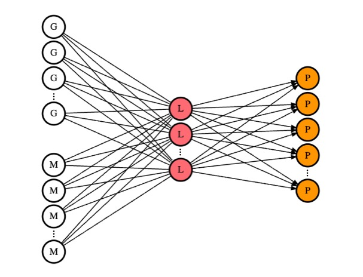

# ridge redundancy analysis (rrda)

## Data

For the application data, the data for breast cancer (Witten et al., 2009) and soybean data (Dang et al., 2023) are stored on this page. Also, refer to Ruiz-Arenas and González 2020) for the methylation data. 

The metabolome data were downloaded from the RIKEN DropMet website (http://prime.psc.riken.jp/menta.cgi/prime/drop_index) ; ID: DM0071, DM0072.

## Overview

Hello Bonjour,

Here I store all the scripts for the simulations and applications, and my own functions used for the analysis. Also, all the application data is stored as .rds file in a folder (RDAdata)

This package provides functions for performing **Ridge Redundancy Analysis (rrda)**, which is useful for modeling the relationship between a matrix of response variables (**Y**; n × q ) and a matrix of explanatory variables (**X**;  n × p ). The method is designed to handle **high-dimensional data efficiently**, allowing computation and storage optimization.

This repository contains functions for Ridge Redundancy Analysis (rrda) and cross-validation for high-dimensional regression problems, such as omics data analysis. The main functions are `rrda.fit` for fitting the rrda model and `rrda.cv` for performing cross-validation.

## Installation

You can install the package from GitHub using the `devtools` package:

```r
devtools::install_github("Yoska393/rrda", dependencies = TRUE)
```

## Dependencies

- `RSpectra`
- `furrr`
- `dplyr`
- `reshape2`
- `ggplot2`


## Functions

### `rrda.fit`

Performs Ridge Redundancy Analysis (rrda) to obtain the coefficient matrix (Bhat), which models the relationship between a matrix of response variables (Y) and a matrix of explanatory variables (X).

#### Parameters:
- `Y` : Numeric matrix of response variables.
- `X` : Numeric matrix of explanatory variables.
- `nrank` : Numeric vector specifying the ranks of Bhat. Default is NULL, which sets it to (1:min(15, min(dim(X), dim(Y)))).
- `lambda` : Numeric vector of ridge penalty values. Default value is 1.
- `component` : Logical indicating if Bhat is returned as component vectors. Default is TRUE.
- `center.X` : Logical indicating if X should be centered. Default is TRUE.
- `center.Y` : Logical indicating if Y should be centered. Default is TRUE.
- `scale.X` : Logical indicating if X should be scaled. Default is FALSE.
- `scale.Y` : Logical indicating if Y should be scaled. Default is FALSE.

#### Returns:
A list containing Bhat components or matrices (the coefficient of Ridge Redundancy Analysis for each parameter lambda and nrank), ranks, and lambda values.

#### Example:
```r
simdata <- rdasim1(n = 100, p = 200, q = 200, k = 5)
X <- simdata×X
Y <- simdata×Y

# Sequential
Bhat <- rrda.fit(Y = Y, X = X, nrank = c(1:10))
names(Bhat)
```

### `rrda.cv`

Performs cross-validation to evaluate the performance of Ridge Redundancy Analysis (RDA) models. It calculates the mean squared error (MSE) for different ranks and ridge penalty values through cross-validation folds.

#### Parameters:
- `Y` : Numeric matrix of response variables.
- `X` : Numeric matrix of explanatory variables.
- `maxrank` : Numeric vector specifying the maximum rank of the coefficient Bhat. Default is NULL, which sets it to (min(15, min(dim(X), dim(Y)))).
- `lambda` : Numeric vector of ridge penalty values. Default is NULL, where the lambda values are automatically chosen.
- `nfold` : The number of folds for cross-validation. Default is 10.
- `folds` : A vector specifying the folds. Default is NULL, which randomly assigns folds.
- `sample.X` : Number of variables sampled from X for the lambda range estimate. Default is 1000.
- `sample.Y` : Number of variables sampled from Y for the lambda range estimate. Default is 1000.
- `scale.X` : Logical indicating if X should be scaled. Default is FALSE.
- `scale.Y` : Logical indicating if Y should be scaled. Default is FALSE.
- `center.X` : Logical indicating if X should be centered. Default is TRUE.
- `center.Y` : Logical indicating if Y should be centered. Default is TRUE.
- `verbose` : Logical indicating if the function should display information about the function call. Default is TRUE.

#### Returns:
A list containing the cross-validated MSE matrix, lambda values, rank values, and the optimal lambda and rank.

#### Example:
```r
simdata <- rdasim1(n = 100, p = 200, q = 200, k = 5)
X <- simdata×X
Y <- simdata×Y

cv_result <- rrda.cv(Y = Y, X = X)
rrda.summary(cv_result = cv_result)

# Complete Example
cv_result <- rrda.cv(Y = Y, X = X, maxrank = 10) # cv
rrda.summary(cv_result = cv_result) # cv result

# Plot the CV result
p <- rrda.plot(cv_result)
print(p)

# Heatmap of the CV result
h <- rrda.heatmap(cv_result)
print(h)

# Extract optimal parameters
estimated_lambda <- cv_result×opt_min×lambda
estimated_rank <- cv_result×opt_min×rank

# Fit the model with the optimal parameters
Bhat <- rrda.fit(Y = Y, X = X, nrank = estimated_rank, lambda = estimated_lambda)
Bhat_mat <- rrda.coef(Bhat)

# Make predictions
Yhat_mat <- rrda.predict(Bhat = Bhat, X = X)
Yhat <- Yhat_mat[[1]][[1]][[1]]

# Correlation
cor_Y_Yhat <- diag(cor(Y, Yhat))
summary(cor_Y_Yhat)
```

## References
- Dang, T., Fuji, Y., Kumaishi, K., Usui, E., Kobori, S., Sato, T., Toda, Y., Sakurai, K., Yamasaki, Y., Tsujimoto, H. and Hirai, M.Y., 2023. An integrative framework of stochastic variational variable selection for joint analysis of multi-omics microbiome data. bioRxiv, pp.2023-08.
- Ruiz-Arenas C, Gonzalez J (2024). MEAL: Perform methylation analysis. R package version 1.34.0.
- Witten D, Tibshirani R, Gross S, Narasimhan B (2024). PMA: Penalized Multivariate Analysis. R package version 1.2-4,
- Yoshioka, H., Aubert, J., Iwata, H., and Mary-Huard, T., 2025. RRDA: Ridge Redundancy Analysis for High-Dimensional Omics Data.
