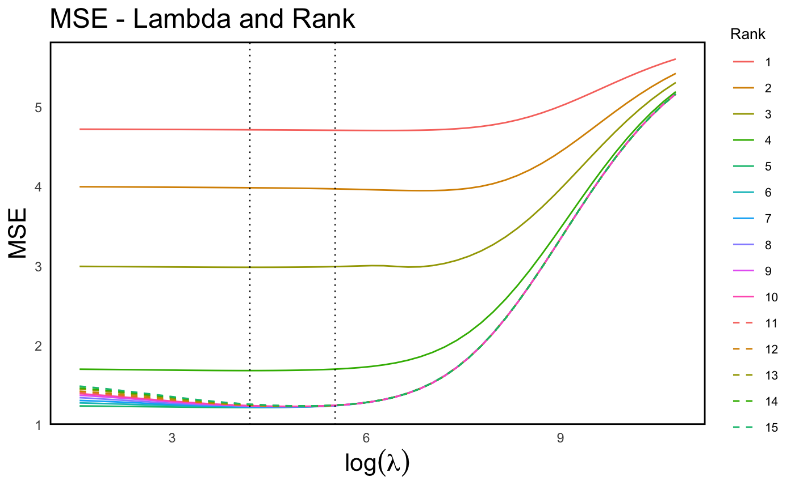
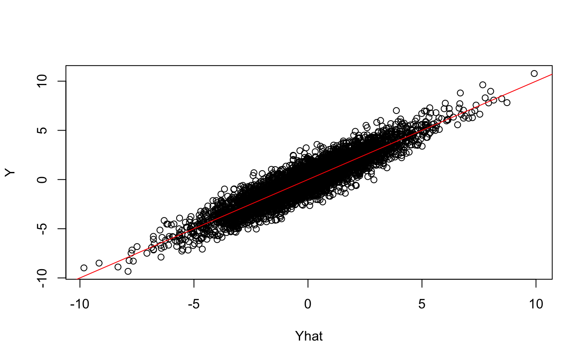
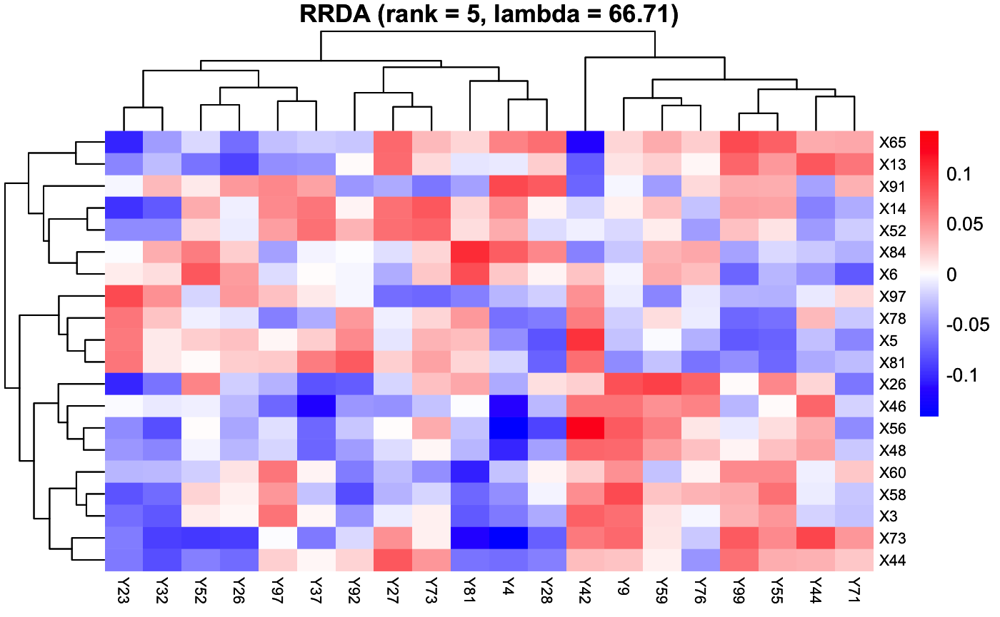

# rrda: Ridge Redundancy Analysis for High-Dimensional Omics Data 

<!-- badges: start -->
[](https://cran.r-project.org/package=rrda)
[](https://cran.r-project.org/package=rrda)
[](https://cran.r-project.org/package=rrda)

<!-- badges: end -->

> The R package `rrda` provides functions for performing **ridge redundancy analysis (rrda)** 
> for high-dimensional datasets. It is useful for modeling the relationship between a matrix
>  of response variables (**Y**; n × q ) and a matrix of explanatory variables (**X**;  n × p )
>  with ridge penalty and rank restraint. The method is designed to handle **high-dimensional
> data**, allowing efficient computation and storage optimization.

## 🌴 Overview

This repository serves **two complementary purposes**:

1. **R package distribution**  
   It provides the implementation of the R package `rrda`, designed for ridge redundancy analysis in high-dimensional data.

2. **Reproducibility of the paper**  
   It includes datasets, analysis scripts, and supplementary materials used in our study, allowing users to reproduce the analyses and explore practical applications.

Thus, this repository functions both as a **software repository** and a **reproducibility repository**.

---

## 🚀 Quick Navigation

- **Install and use the package** → see [Installation](#-installation) and [Tutorial](#-tutorial)  
- **Access datasets and reproduce the analyses** → see [Application Data](#-application-data) and [`script_rrda/`](./script_rrda/)  
- **Paper link** → https://doi.org/10.1101/2025.04.16.649138  


---

## 🛠 Installation

You can install the package from CRAN.

```{}
install.packages("rrda")
```

## 🐟 Tutorial

```{r}
# rrda is updated if the version is old
required_version <- "0.2.3"  

if (!requireNamespace("rrda", quietly = TRUE) ||
    packageVersion("rrda") < required_version) {
  message("rrda will be updated")
  install.packages("rrda", repos = "https://cloud.r-project.org", type = "source")
}
```


#### Example 1: Fitting

`rdasim1` function generates rank-restricted matrices X and Y. 

```{r}
library(rrda)
set.seed(10)
simdata<-rdasim1(n = 50,p = 100,q = 100,k = 5)
X <- simdata$X
Y <- simdata$Y
```
`rrda.fit` function solves the rrda (ridge redundancy) for X and Y. 
This is equivalent to the prediction from X to Y, where Y = XB + E.

`nrank` indicates the rank restrictions for the model. Here, it is the value of 1 to 5.

`lambda` indicates the ridge penalty for the model. Here, it is the value of 0.1, 1, 10.   

The model solves several ranks and lambdas efficiently. In the default setting, the model returns all the combinations of 15 ranks and 50 lambda grid.

```{r}
Bhat <- rrda.fit(Y = Y, X = X)
names(Bhat)
```

When you see the Bhat, you will see the list composed of each lambda. In each lambda value, you have the coefficient `B` according to each rank.

(Note! The Bhat is stored in a decomposed form. This is because the function is designed for high-dimensional settings.)

#### Example 2: Parameter Tuning by Cross-Validation

Here we illustrate the parameter tuning process (regularization path), which helps identify the optimal parameter for maximizing prediction accuracy from **X** to **Y**.

How do we know the best lambda and rank for the model??
-> Cross-validation by `rrda.cv` function

```{r}
cv_result<- rrda.cv(Y = Y, X = X)
rrda.summary(cv_result = cv_result)

p <- rrda.plot(cv_result) # cv result plot
print(p)
```


`rrda.summary` tells you the parameters suggested via CV. 

```
=== opt_min ===
MSE: 
[1] 3.179695
rank: 
[1] 5
lambda: 
[1] 22.43
```

Also, `rrda.plot` and `rrda.heatmap` show you the figures to select the parameters.

<div style="display: flex; align-items: center; gap: 10px;">
  
</div>

```{r}

# Choose the best parameter sets which gives the minimum MSE

best_lambda<-cv_result$opt_min$lambda  # selected parameter
best_rank<-cv_result$opt_min$rank # selected parameter

# Fitting with the best parameters
Bhat <- rrda.fit(Y = Y, X = X, nrank = best_rank,lambda = best_lambda) 

# Prediction
Yhat_mat <- rrda.predict(Bhat = Bhat, X = X) 
Yhat<-Yhat_mat[[1]][[1]][[1]] # predicted values

plot(Yhat, Y)
abline(0, 1, col = "red") 
```

<div style="display: flex; align-items: center; gap: 10px;">
  
</div>

#### Visualize and Select the Best Parameter

We visualize the **feature–feature matrix** using a selected dimensionality, highlighting the most informative features based on L2 norm.

```{r}
best_lambda<-cv_result$opt_min$lambda  
best_rank<-cv_result$opt_min$rank
rrda.top(Y=Y,X=X,nrank=best_rank,lambda=best_lambda,mx=20,my=20)
```


## For more exercises with application data

Go to Rpubs (https://rpubs.com/Yoska393/1351133).

---

## 📊 Application Data


The application datasets used in this study are summarized below.

| Dataset | Files | Format | Location | Notes |
|--------|------|--------|----------|------|
| Soybean | `SoyData.RDS`, `soymet.csv`, `soymicro.csv` | RDS / CSV | [`RDAdata/`](./RDAdata/)  | Multi-omics dataset (genome, metabolome, microbiome) |
| Breast cancer | `breast.RDS` | RDS | [`RDAdata/`](./RDAdata/)  | Integrated omics dataset |
| TCGA methylation | Not included | — | Open Source | See script `rrda_script/Meth.rmd` for download and preprocessing |


The TCGA methylation dataset is too large to be hosted on GitHub.  
The TCGA data along with CpG annotation, can be obtained as follows:

```r
# install if needed
if (!requireNamespace("BiocManager", quietly = TRUE))
    install.packages("BiocManager")

BiocManager::install(c(
  "brgedata",
  "IlluminaHumanMethylation450kanno.ilmn12.hg19"
))

library(brgedata)
library(IlluminaHumanMethylation450kanno.ilmn12.hg19)

data(brge_methy)
data(brge_gexp)
```

---

## 📂 Repository Structure

| Section | Folder / File | Description |
|--------|----------------|-------------|
| Package | [`src/`](./src/) | Core implementation of the `rrda` method |
| Reproducibility | [`RDAdata/`](./RDAdata/) | Application datasets (soybean, breast cancer) |
| Reproducibility | [`script_rrda/`](./script_rrda/) | Analysis workflows and preprocessing scripts |
| Reproducibility | [`lecture/`](./lecture/) | Supplementary materials and lecture notes |
| Other | [`image/`](./image/) | Figures used in documentation |
---

## 📚 References 

Please cite :)

- Yoshioka, H., Aubert, J., Iwata, H., and Mary-Huard, T., 2025. Ridge Redundancy Analysis for High-Dimensional Omics Data. *bioRxiv*, doi: 10.1101/2025.04.16.649138

- Yoshioka H, Aubert J, and Mary-Huard T (2025). rrda: Ridge Redundancy Analysis for High-Dimensional Omics Data.  https://CRAN.R-project.org/package=rrda (CRAN R Package) 
